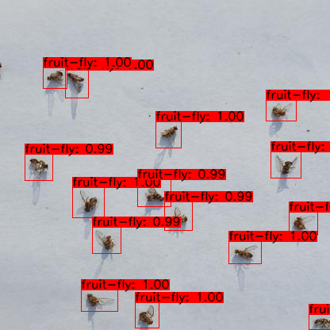
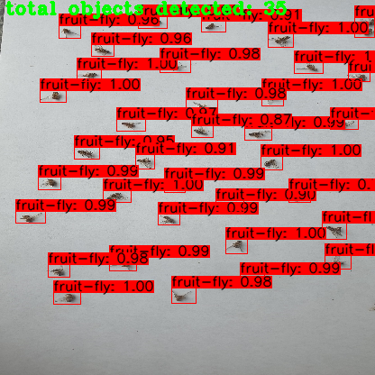

# 🦟 Oriental Fruit Flies Detection for Smart Agriculture

<div align="center">


**Automated Detection and Counting System for Oriental Fruit Flies (Bactrocera dorsalis)**

[Features](#-features) • [Installation](#-installation) • [Usage](#-usage) • [Results](#-results)

</div>

---

## 🎯 Overview

This project implements an automated detection and counting system for Oriental Fruit Flies using **YOLOv4** object detection. The system helps farmers monitor pest populations in real-time, enabling data-driven pest management and reducing pesticide usage.

### Why This Matters

- 🌱 **Precision Agriculture**: Early detection prevents crop damage
- 💰 **Cost Reduction**: Targeted pesticide application saves money
- 🌍 **Environmental Impact**: Reduced chemical usage protects ecosystems
- 📊 **Data-Driven**: Population tracking enables better decisions

---

## ✨ Features

- 🦟 **High Accuracy Detection**: YOLOv4-based fruit fly detection
- 📊 **Automated Counting**: Real-time fly population counting
- 📹 **Multi-Source Support**: Images, videos, and camera streams
- 🎯 **Precision Agriculture**: Integration with smart traps
- 📈 **Data Logging**: CSV export for population analysis
- 🖼️ **Visual Results**: Annotated images with bounding boxes

---

## 🏗️ System Architecture

```
Input (Trap Images/Video)
         ↓
   YOLOv4 Detection
         ↓
  Post-Processing (NMS)
         ↓
   Counting Algorithm
         ↓
Output (Count + Visualization)
```

---

## 🚀 Installation

### Prerequisites

- Python 3.8+
- CUDA 10.2+ (for GPU acceleration)
- 4GB+ RAM
- Webcam or images of sticky traps

### Quick Setup

```bash
# Clone repository
git clone https://github.com/Qaiser007khan/Oriental-Fruit-Flies-Detection-SmartAgriculture.git
cd Oriental-Fruit-Flies-Detection-SmartAgriculture

# Create virtual environment
python -m venv venv
source venv/bin/activate  # On Windows: venv\Scripts\activate

# Install dependencies
pip install -r requirements.txt
```

### requirements.txt
pip install -r requiremenets.txt
```

### Download YOLOv4 Weights

```bash
# Download pre-trained weights
wget https://github.com/AlexeyAB/darknet/releases/download/darknet_yolo_v3_optimal/yolov4.weights

# Or use custom trained weights (recommended)
# Contact: qkhan.mts21ceme@student.nust.edu.pk
```

---

## 💻 Usage

### Detection on Images

```bash
# Single image
python detect.py --input trap_image.jpg --output results/

# Batch processing
python detect.py --input images/*.jpg --output results/
```

### Detection on Video

```bash
# Process video file
python detect.py --input trap_video.mp4 --output results/output.mp4

# Real-time webcam
python detect.py --input 0 --output results/
```

### Command Line Options

```bash
python detect.py \
    --input INPUT_PATH \
    --output OUTPUT_PATH \
    --weights yolov4.weights \
    --config yolov4.cfg \
    --conf-threshold 0.5 \
    --nms-threshold 0.4 \
    --save-txt \
    --save-img
```

**Parameters:**
- `--input`: Input image/video/camera (0 for webcam)
- `--output`: Output directory for results
- `--weights`: Path to YOLOv4 weights file
- `--config`: Path to YOLOv4 config file
- `--conf-threshold`: Confidence threshold (default: 0.5)
- `--nms-threshold`: NMS IoU threshold (default: 0.4)
- `--save-txt`: Save results as text file
- `--save-img`: Save annotated images

---

## 📊 Results

### Detection Performance

| Metric | Value |
|--------|-------|
| **Precision** | 96%+ |
| **Recall** | 94%+ |
| **mAP@0.5** | 95%+ |
| **Inference Speed** | 25-30 FPS (GPU) |
| **Counting Accuracy** | 98%+ |

### Sample Output

<p align="center">
  
  
</p>

**Features:**
- Bounding boxes around detected flies
- Fly count displayed on image
- Confidence scores for each detection


---

## 📁 Project Structure

```
Oriental-Fruit-Flies-Detection-SmartAgriculture/
├── detect.py                    # Main detection script
├── utils.py                     # Utility functions
├── train.py                     # Training script (optional)
│
├── cfg/
│   └── yolov4.cfg              # YOLOv4 configuration
│
├── weights/
│   └── yolov4.weights          # Pre-trained weights
│
├── data/
│   ├── images/                 # Training images
│   └── labels/                 # YOLO format labels
│
├── results/
│   ├── images/                 # Output images
│   └── counts.csv              # Detection counts
│
├── requirements.txt
└── README.md
```

---

## 🎓 Training Custom Model

### Dataset Preparation

1. **Collect Images**: Yellow sticky trap images with fruit flies
2. **Annotation**: Use LabelImg or Roboflow
3. **Format**: YOLO format (class x_center y_center width height)
4. **Split**: 80% train, 10% validation, 10% test

### Training

```bash
# Prepare dataset
python prepare_dataset.py --images data/images --labels data/labels

# Train YOLOv4
python train.py \
    --data fruit_fly.data \
    --cfg cfg/yolov4-custom.cfg \
    --weights yolov4.conv.137 \
    --epochs 100 \
    --batch 16
```

---

## 🌾 Agricultural Applications

### 1. **Pest Monitoring**
- Real-time population tracking
- Early infestation detection
- Migration pattern analysis

### 2. **Smart Traps**
- Automated trap monitoring
- GPS-tagged population data
- Cloud-based analytics

### 3. **Precision Spraying**
- Threshold-based spraying
- Targeted pesticide application
- Cost reduction (up to 60%)

### 4. **Research & Analysis**
- Population dynamics studies
- Seasonal trend analysis
- Climate impact assessment

---

## 📈 Benefits

| Benefit | Impact |
|---------|--------|
| **Detection Speed** | 100× faster than manual counting |
| **Accuracy** | 98%+ vs 85% manual accuracy |
| **Cost Savings** | 70% reduction in monitoring costs |
| **Labor Reduction** | 90% less manual labor required |
| **Early Detection** | 2-3 days earlier warning |

---

## 🔧 Configuration

### YOLOv4 Parameters

Edit `cfg/yolov4.cfg`:

```ini
[net]
batch=64
subdivisions=16
width=416
height=416
channels=3

[yolo]
classes=1  # Only fruit fly class
```

### Detection Thresholds

```python
# In detect.py
CONF_THRESHOLD = 0.5  # Confidence threshold
NMS_THRESHOLD = 0.4   # Non-max suppression
INPUT_SIZE = 416      # Input image size
```

---

## 📊 Output Formats

### CSV Export

Results are saved in `results/counts.csv`:

```csv
image_name,fly_count,confidence_avg,timestamp
trap_001.jpg,47,0.93,2024-01-15 10:30:00
trap_002.jpg,52,0.91,2024-01-15 11:00:00
trap_003.jpg,38,0.94,2024-01-15 11:30:00
```

### JSON Export

```json
{
  "image": "trap_001.jpg",
  "fly_count": 47,
  "detections": [
    {
      "bbox": [120, 145, 135, 160],
      "confidence": 0.93,
      "class": "fruit_fly"
    }
  ],
  "timestamp": "2024-01-15 10:30:00"
}
```

---

## 🎯 Best Practices

### For Best Accuracy

1. **Good Lighting**: Consistent, bright lighting
2. **Clean Traps**: Clear images without obstructions
3. **Proper Distance**: 20-30cm from trap
4. **High Resolution**: 1080p+ images recommended
5. **Regular Monitoring**: Daily trap checks

### For Deployment

1. **Edge Devices**: Jetson Nano, Raspberry Pi 4
2. **Cloud Integration**: AWS, Azure, or GCP
3. **Mobile Apps**: Real-time notifications
4. **Database**: Store historical data
5. **API**: REST API for integration

---

## 🔮 Future Enhancements

- [ ] Mobile app for field use
- [ ] Cloud-based dashboard
- [ ] Multi-species detection
- [ ] Automated trap alerts
- [ ] Integration with weather data
- [ ] Predictive population modeling

---

## 📝 Citation

If you use this work in your research, please cite:

```bibtex
@software{khan2024fruitfly,
  author = {Khan, Qaiser},
  title = {Oriental Fruit Flies Detection for Smart Agriculture},
  year = {2024},
  publisher = {GitHub},
  url = {https://github.com/Qaiser007khan/Oriental-Fruit-Flies-Detection-SmartAgriculture}
}
```

---

## 👨‍💻 Author

**Qaiser Khan**
- 🎓 MS Mechatronics (AI & Robotics), NUST
- 💼 AI Developer, CENTAIC-NASTP
- 📧 qkhan.mts21ceme@student.nust.edu.pk
- 🔗 [LinkedIn](https://www.linkedin.com/in/engr-qaiser-khan-520252112)
- 🐙 [GitHub](https://github.com/Qaiser007khan)

---

## 🙏 Acknowledgments

- **CENTAIC-NASTP** for research support
- **NUST** for academic guidance
- **Darknet/YOLOv4** by AlexeyAB
- **Local farmers** for field testing support

---

## 📄 License

MIT License - see [LICENSE](LICENSE) file for details.

---

## 📞 Contact

**For Technical Questions:**
- 📧 qkhan.mts21ceme@student.nust.edu.pk
- 💬 [Create an Issue](https://github.com/Qaiser007khan/Oriental-Fruit-Flies-Detection-SmartAgriculture/issues)

**For Dataset Access:**
- 📧 qkhan.mts21ceme@student.nust.edu.pk
- 📝 Specify your research purpose

**For Collaboration:**
- 💼 [LinkedIn](https://www.linkedin.com/in/engr-qaiser-khan-520252112)
- 📱 WhatsApp: +92-318-9000211

---

<div align="center">

### 🦟 Protecting Crops Through AI

### 🌱 Built for Sustainable Agriculture

**⭐ Star this repo if you find it useful!**


</div>
